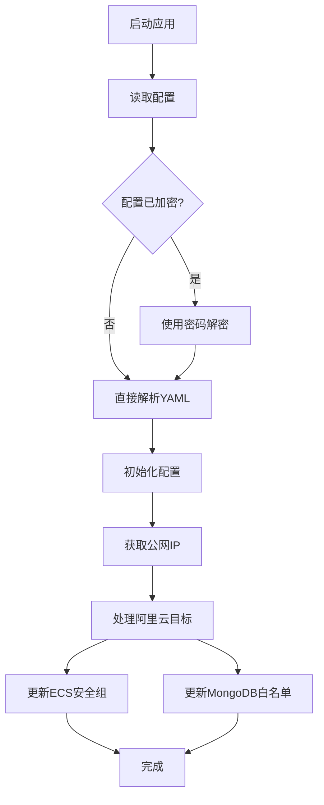

# AutoSetIP

一个自动更新阿里云ECS安全组和MongoDB实例IP白名单的工具。当你的公网IP地址发生变化时，AutoSetIP可以自动检测当前IP并更新云资源的访问控制规则。

## 核心功能

### 🌐 自动IP检测
- 支持多个外部IP检测服务，提供可靠的IP获取机制
- 自动验证获取的IP地址格式
- 默认支持 `https://ips.im/api` 和 `https://api.ipify.org`

### 🛡️ ECS安全组管理
- 自动更新阿里云ECS安全组规则
- 支持多个端口配置
- 智能检测现有规则并更新，不存在则创建新规则
- 支持多区域、多账号配置

### 🗄️ MongoDB IP白名单管理
- 自动更新阿里云MongoDB实例的IP白名单
- 支持安全IP组的创建和更新
- 基于匹配键(match key)进行精确管理

### 🔐 配置加密
- 支持AES加密配置文件，保护敏感信息
- 可选择使用加密或明文配置
- 内置配置文件到可执行文件的打包功能

## 项目结构

```
autosetip.go/
├── app/                 # 主应用程序
│   ├── main.go            # 应用入口，支持加密配置读取
│   └── Build.ps1          # 应用构建脚本
├── encrypt/             # 配置加密工具
│   └── main.go            # AES加密实现
├── lib/                 # 核心功能库
│   ├── core.go            # 主要业务逻辑
│   └── core_test.go       # 单元测试
├── one/                 # 单文件版本
│   └── main.go            # 内置加密配置的独立版本
├── build.ps1            # 完整构建脚本
├── encrypt.ps1          # 配置加密脚本
└── README.md            # 项目文档
```

## 安装和配置

### 环境要求
- Go 1.16+
- 阿里云账号和相应的API权限

### 必需的阿里云权限

为了使用AutoSetIP，您需要为阿里云账号配置以下权限：

**ECS权限：**
```json
{
    "Version": "1",
    "Statement": [
        {
            "Effect": "Allow",
            "Action": [
                "ecs:DescribeSecurityGroupAttribute",
                "ecs:AuthorizeSecurityGroup",
                "ecs:ModifySecurityGroupRule"
            ],
            "Resource": "acs:ecs:*:123123:securitygroup/xxxxxxxx"
        }
    ]
}
```

**MongoDB权限：**
```json
{
    "Version": "1",
    "Statement": [
        {
            "Effect": "Allow",
            "Action": [
                "dds:DescribeSecurityIps",
                "dds:ModifySecurityIps"
            ],
            "Resource": "acs:mongodb:*:123123:dbinstance/dds-xxxxxxxx"
        }
    ]
}
```

### 配置文件示例

创建 `config.yaml` 配置文件：

```yaml
# IP检测API列表（可选，会使用默认值）
ip_api_url:
  - "https://ips.im/api"
  - "https://api.ipify.org"

# 匹配键，用于识别和管理规则
key: "my-laptop"

# 阿里云配置
aliyun:
  - name: "production"
    ecs:
      - region: "cn-shanghai"
        access_key: "your_access_key"
        secret_key: "your_secret_key"
        security_group_id: "sg-xxxxxxxxx"
        port: ["22", "80", "443"]  # 可选，默认为22
    mongo:
      - access_key: "your_access_key"
        secret_key: "your_secret_key"
        instance_id: "dds-xxxxxxxxx"
  
  - name: "development"
    ecs:
      - region: "cn-beijing"
        access_key: "your_dev_access_key"
        secret_key: "your_dev_secret_key"
        security_group_id: "sg-yyyyyyyyy"
        port: ["22", "3000"]
```

## 使用方法

### 1. 基础用法（明文配置）

```bash
# 编译应用
cd app
go build -o autosetip main.go

# 运行
./autosetip config.yaml "" my-laptop
```

### 2. 加密配置用法

```bash
# 第一步：加密配置文件
./encrypt.ps1 mypassword config.yaml

# 第二步：使用加密配置运行
./autosetip config.yaml mypassword my-laptop
```

### 3. 一键构建和打包

```bash
# 构建包含加密配置的独立可执行文件
./build.ps1 mypassword config.yaml output-folder

# 运行打包后的程序
./output-folder/one.exe mypassword my-laptop
```

### 参数说明

- 第一个参数：配置文件路径（默认：`config.yaml`）
- 第二个参数：解密密码（可选，如果配置文件未加密则留空）
- 第三个参数：匹配键覆盖（可选，会覆盖配置文件中的key值）

## 核心工作原理

### 架构流程



### 多账号支持

AutoSetIP支持同时管理多个阿里云账号和多个区域的资源：

- 每个 `AliyunTarget` 代表一个独立的配置组
- 支持不同区域的ECS实例
- 支持多个MongoDB实例
- 每个资源可以使用不同的AccessKey和SecretKey

### IP检测机制

程序按顺序尝试配置的IP检测服务：
1. 依次调用配置中的IP检测API
2. 验证返回的IP格式是否有效
3. 使用第一个成功返回有效IP的服务
4. 如果所有服务都失败，程序退出

### 安全规则管理

**ECS安全组：**
- 根据匹配键查找现有规则
- 如果规则存在，更新IP地址
- 如果规则不存在，创建新规则
- 支持多端口配置

**MongoDB白名单：**
- 基于匹配键查找安全IP组
- 使用"覆盖"模式更新IP列表
- 自动创建不存在的安全IP组

## 开发和测试

### 运行测试

```bash
cd lib
go test -v
```

### 构建应用

```bash
# 构建主应用
cd app
go build -o autosetip main.go

# 构建加密工具
cd encrypt
go build -o encrypt main.go

# 构建独立版本
cd one
go build -o one main.go
```

## 使用场景

### 远程开发
当远程工作时，开发者的公网IP经常变化。使用AutoSetIP可以：
```bash
./autosetip config.yaml mypassword work-laptop
```
自动更新所有配置的ECS实例和MongoDB数据库，允许从当前IP访问。

### 团队协作
多个团队成员可以使用不同的匹配键：
```bash
# 张三使用
./autosetip config.yaml "" zhangsan-laptop

# 李四使用  
./autosetip config.yaml "" lisi-desktop
```

### CI/CD集成
在自动化部署流程中，可以集成AutoSetIP来动态更新构建服务器的访问权限。

## 安全注意事项

1. **配置文件保护**：使用AES加密保护包含敏感信息的配置文件
2. **权限最小化**：只授予必要的阿里云API权限
3. **密钥管理**：妥善保管AccessKey和SecretKey
4. **定期轮换**：定期更新API密钥和加密密码

## 故障排除

### 常见问题

**1. IP检测失败**
- 检查网络连接
- 验证IP检测服务是否可用
- 尝试添加其他IP检测服务到配置

**2. 权限错误**
- 确认阿里云账号具有必要的ECS和MongoDB权限
- 检查AccessKey和SecretKey是否正确

**3. 安全组规则冲突**
- 确保匹配键唯一性
- 避免手动修改由AutoSetIP管理的规则

**4. 配置解密失败**
- 验证密码是否正确
- 确认配置文件未损坏

## 贡献

欢迎提交Issue和Pull Request来改进这个项目。

## 许可证

本项目采用MIT许可证。